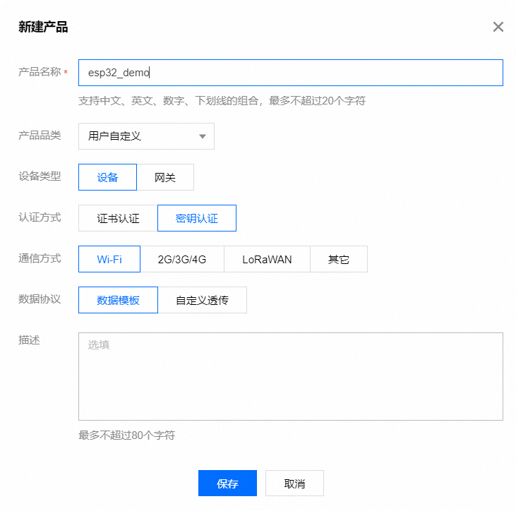
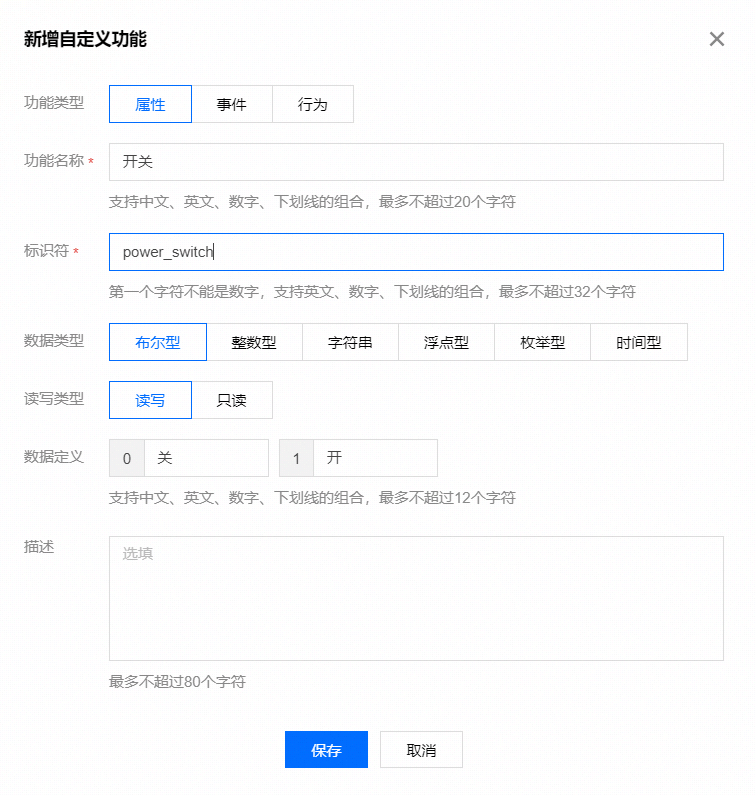

# 文档说明
 1. 使用ESP TOUCH APP配网，下载链接
```
 https://www.espressif.com/zh-hans/support/download/apps
```
 2. 腾讯云 `SDK 3.1.1 `   ESP-IDF: `release/v4.2`

 3. 对 `qcloud-iot-sdk-embedded-c` 中 `data_template_light` 进行修改参考`6.其他说明`

 4. 暂未实现OTA升级功能

### 1.在腾讯云物联网平台注册


### 2.创建数据模板


### 3.新建设备


### 4.修改设备三元组信息
到components/qcloud_iot/qcloud_iot_c_sdk/platform/HAL_Device_freertos.c里面修改在腾讯云物联网平台注册的设备信息（目前仅支持密钥设备）：

```
/* Product Id */
static char sg_product_id[MAX_SIZE_OF_PRODUCT_ID + 1]    = "PRODUCT_ID";
/* Device Name */
static char sg_device_name[MAX_SIZE_OF_DEVICE_NAME + 1]  = "YOUR_DEV_NAME";
/* Device Secret */
static char sg_device_secret[MAX_SIZE_OF_DEVICE_SECRET + 1] = "YOUR_IOT_PSK";
```

### 5.编译及烧写
1. 执行`idf.py menuconfig`可进行功能配置，顶层菜单里面有对本示例的配置（QCloud IoT demo Configuration）
```
   [*] To demo IoT Explorer (y) or IoT Hub (n)                                       
         Select explorer demo example (Smart light example)  --->                      
   [*] To use WiFi config or not                                          
   (YOUR_SSID) WiFi SSID                                                             
   (YOUR_WIFI_PW) WiFi PASSWORD   
```

2. 第一项可选择演示IoT Explorer示例（勾选）或者IoT Hub示例（不勾选），勾选IoT Explorer示例，则可通过示例选择子菜单进一步选择需要demo的示例，支持的示例有智能灯、网关、OTA、二进制、MQTT 。智能灯使用GPIO_12。

```
		   Select explorer demo example 
  Use the arrow keys to navigate this window or press the      
  hotkey of the item you wish to select followed by the <SPACE 
  BAR>. Press <?> for additional information about this        
 ┌───────────────────────────────────────────────────────────┐ 
 │                  (X) Smart light example                  │ 
 │                  ( ) Gateway example                      │ 
 │                  ( ) OTA example                          │ 
 │                  ( ) Raw data example                     │ 
 │                  ( ) Mqtt example                         │ 
 │                                                           │ 
 └───────────────────────────────────────────────────────────┘ 
```

3. 第二项可选择是先进入WiFi配网模式（勾选）或者直接连接目标WiFi路由器（不勾选），配网模式需要与ESP TOUCH进行配合如果选择直接连接WiFi目标路由器，则后面两项可以用于配置要连接的WiFi路由器热点信息

4. 使用 `idf.py flash monitor` 完成编译烧写工作，`idf.py erase_flash` 可擦除配网信息

### 6. 调试
可用通过腾讯云提供的在线调试功能，实时下发数据


### 7.其他说明
```
_setup_template_init_params   用于初始化MQTT连接参数 默认即可

_init_data_template           初始化数据模板 该模板即为步骤2中所创建的，可以用通过 
                              https://github.com/tencentyun/qcloud-iot-explorer-sdk-embedded-c/tree/master/tools 生成
                              也可以直接在其中修改属性

_register_data_template_property  注册上一步所创建的模板属性

_register_data_template_action

_get_sys_info                向平台推送设备信息 包括硬件信息等

IOT_Template_GetStatus_sync  同步平台与本地状态 

deal_down_stream_user_logic  处理用户逻辑 

_refresh_local_property 

cycle_report                 可以周期性的推送数据

```